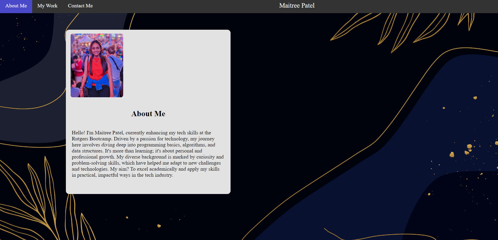
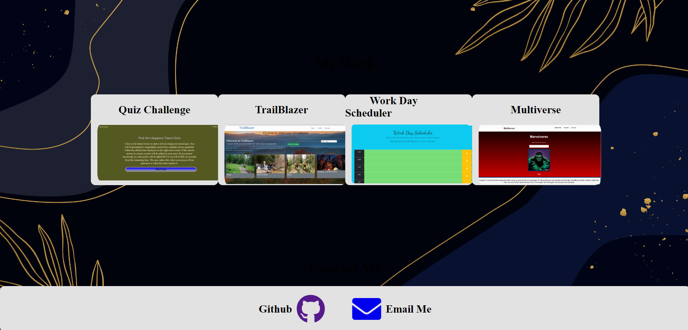

# My-Portfolio

## Description

This project showcases my journey in developing a responsive and professional portfolio website, tailored for potential employers to explore. The process was an enlightening experience, especially in mastering the intricacies of flex boxes – a concept I initially found challenging.

## Installation

N/A

## Usage

The website is structured into three primary sections: _About Me_, _My Work_, and _Contact Me_, all accessible via the navigation bar or through scrolling.

- **About Me:** This section is an introductory narrative, offering visitors a glimpse into my professional background and interests.
- **My Work:** Here, you'll find a collection of projects I've completed. Clicking on the images or titles takes you to detailed pages that showcase my skills and the breadth of my work.

- **Contact Me:** This section provides two key functionalities. The "Email Me" button initiates an email, facilitating direct communication, while the "My GitHub" button redirects to my GitHub profile, providing insights into my coding journey and projects.

Feel free to browse, explore, and connect!

Access the website here: file:///C:/Users/avpat/OneDrive/Desktop/Portfolio/My-Portfolio/index.html

## Contributing

N/A

## Tests

N/A

## Questions

For any questions, please contact me:

- GitHub: [@MaitreePatel08](https://github.com/MaitreePatel08)
- Email: maitreepatel012@gmail.com